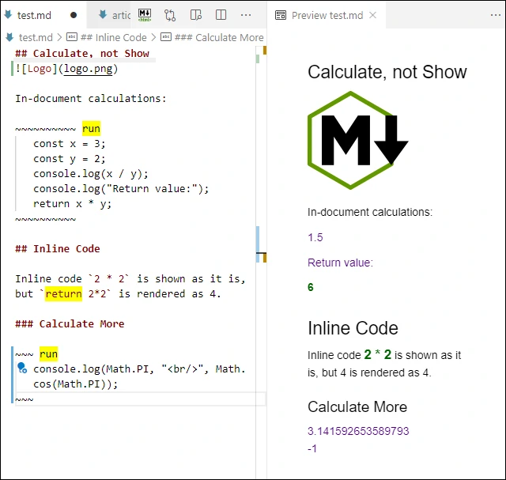

@numbering {
    enable: false
}

{title}Markdown Calculator

<!--
Original publication:
https://www.codeproject.com/Articles/5297157/Markdown-Calculator
-->

[*Sergey A Kryukov*](https://www.SAKryukov.org){.author}

This is just a funny Visual Studio Code extension, but... what can happen if somebody will try to use it seriously?

*Put the keyword (by default, "run") on the same line as the opening fence indicator.
It will force the fenced code to execute instead of rendering it. Put the keyword "return" at the beginning of the inline code sample, and the result of the calculation will be rendered as an inline element; for example, \`return 10**6` will be rendered as 1000000.*

<!-- copy to CodeProject from here ------------------------------------------->

<ul class="download" id="image-top"><li><a href="5291705/Working/JavaScript-Playground.zip">Download source code — 23.4 KB</a></li></ul>



<blockquote id="epigraph" class="FQ"><div class="FQA">Epigraph:</div>
<p><i>If you want to create something totally useless or ridiculous, take it very seriously.
Only then you'll have a chance to succeed.</i></p>
<dd><a href="https://www.codeproject.com/Members/SAKryukov?msg=5790846#xx5790846xx">Author</a></dd>
</blockquote>

## Content{no-toc}

@toc

## Motivation

These days, we can photograph using a cell phone, browse the Web using a refrigerator, and talk to our vacuum cleaner. Having said that, what can we use as a calculator? Probably, something as natural, first of all, some text editor.

Something else? Yes, [another suitable tool would be a browser](https://github.com/SAKryukov/javascript-playground). But now, let's see what can we do with a text editor.

Here, it would be a good time to say that people using computers usually don't have something useful to do the calculations. Indeed, how can we call a calculator a usual Windows or Linux application called "Calculator"? Obviously, the main purpose of such an application was to demonstrate how difficult life before computers was: a user had only a few digits on a tiny low-contrast black-and-white screen and had to press buttons, not really seeing what's going on. To make it even less convenient with the computer simulation, a user is forced to click on those buttons with a mouse.

So, I present my extension to the very convenient feature-rich text editor, open-source cross-platform [Visual Studio Code](https://code.visualstudio.com). This extension based on [Markdown](https://en.wikipedia.org/wiki/Markdown) is closer to the natural way of doing calculations we know from our elementary school: take a piece of paper or a notebook and write some steps of the calculations line by line. We need to write those lines with numbers and arithmetic operators between the lines of the normal text when we write what we do: what's given, what steps we do, and what is are the final results.

Let's see how we can do it.

## Usage

### Insights

Let's say, on this sunny spring day, you are sending a love letter, and you want to send a million  kisses at the end of it. Of course, you need a well-formatted and maintainable document, so you use [Visual Studio Code](https://code.visualstudio.com) with [Markdown](https://en.wikipedia.org/wiki/Markdown).

Naturally, as an advanced engineer, you are not supposed to remember constants and not supposed to do anything manually. You would strongly prefer writing something like `10 ** 6` kisses. Or, if you are even more romantic than that, you may want to send `1 << 20` kisses, that is, one *megakiss*, or, speaking more accurately, one *[mebikiss](https://en.wikipedia.org/wiki/ISO/IEC_80000#Units_of_the_ISO_and_IEC_80000_series)*.

Suppose, however, that your beloved one is not so well-versed in computer languages, and even less accustomed to binary shifts. In this case, you want to write `10 ** 6` but render it in the output document as old good 1000000 kisses.

You can do it by using the Markdown Calculator extension for VSCode and writing `return 10 ** 6` kisses instead of `1000000`.

On the more mature stage of your relationship, you may need to check up your expenses and provide some proof of purchase. You can do in in VSCode using a *fenced code block* with a keyword "run" on first line:

```{lang=Javascript}{id=code-fenced-code-block}
~~~ run
const eggs = 3.49, sourCream = 2.49, milk = 4.99
const gel = 19.99, vitamines = 17.99
const taxable = gel + vitamines
const tax = taxable * 6.25 / 100
const total = eggs + sourCream + milk + taxable + tax
console.log(`Total: $${Math.round(total * 100) / 100}`);
~~~
```

The extension will render it as a result of calculations, shown as the content of the console, created via `console.log`. In this case, it will be `$51.32`. However, `return` also can be used; it will be shown at the end.

You know that the lack of the `return` statement is the same as `return undefined`, and the object `undefined` is the only object rendered by this extension as an empty string, in contrast to `null`, which is rendered as "null".

In all cases, and exceptions are caught and the exception message is rendered using a special CSS style.

You can do all this using just the VSCode preview. For more serious work, you may want to convert your document into HTML; and you can do it by using the extension "[Extensible Markdown](https://github.com/SAKryukov/vscode-extensible-markdown)" described in the article *[All in One Toolchain for Article Writing with Visual Studio Code](https://www.codeproject.com/Articles/1194125/Article-Writing-Toolchain-with-VSCode)*.

### Settings

The installed extension can be turned on or off in the user or workspace settings. Also, two features, calculation performed on a fenced code block or inline code, can be turned on or off independently. Besides, the keyword "run" is configurable, as well as different CSS classes for the output of different `console` functions.

* Markdown > Calculator > Enable: *Enable all extension features, including syntax decorators*
* Markdown > Calculator > Fenced Code Block > Enable: *Enable modification of fenced code block behavior with Markdown Calculator*
* Markdown > Calculator > Fenced Code Block > Enable: *Enable modification of fenced code block behavior with Markdown Calculator*
* Markdown > Calculator > Inline Code > Enable: *Enable modification of inline code behavior with Markdown Calculator*
* Markdown > Calculator > Execution Indicator: *Fence markup used to indicate execution of code instead of regular rendering*; default: `"run"`
* Markdown > Calculator > Keyword Decorator > Color: *Background color to highlight the Execution Endicator*
* Markdown > Calculator > Keyword Decorator > Hover Text: *Hover text showing the purpose of the keyword Execution Indicator*
* Markdown > Calculator > CSS Class > Exception: *CSS class name for exception text rendering*
* Markdown > Calculator > CSS Class > Return: *CSS class name for the calculation return value*
* Markdown > Calculator > CSS Class > Console > Assert: *CSS class name for `console.assert`*
* Markdown > Calculator > CSS Class > Console > Debug: *CSS class name for `console.debug`*
* Markdown > Calculator > CSS Class > Console > Dir: *CSS class name for `console.dir`*
* Markdown > Calculator > CSS Class > Console > Error: *CSS class name for `console.error`*
* Markdown > Calculator > CSS Class > Console > Info: *CSS class name for `console.info`*
* Markdown > Calculator > CSS Class > Console > Log: *CSS class name for `console.log`*
* Markdown > Calculator > CSS Class > Console > Warm: *CSS class name for `console.warn`*

### Console

What is "console", anyway? First of all, this is a [JavaScript object with some API](https://developer.mozilla.org/en-US/docs/Web/API/console). Normally, we use some JavaScript API (again, Visual Studio Code is highly recommended), and it has a console for the developers. But we need something different.

With Visual Studio Code, the standard way of writing the documentation is using [Markdown](https://en.wikipedia.org/wiki/Markdown), and the usual workflow is having the markdown code on left and a *preview* pane on left, where we can immediately see the rendered document --- see the [picture on top](#image-top). This is where we need to get the results of our calculations.

Besides, Markdown can be rendered and saved in an HTML file; and it should render content in the same way. It can be done using the extension [Extensible Markdown](https://www.codeproject.com/Articles/1194125/Article-Writing-Toolchain-with-VSCode). This is how this article was written.

The example of using the function `console.log` is [shown above](#code-fenced-code-block).

### Console with an Inline Code

At a first glance, it looks like it is impossible to use a console output for the inline code fragment because the content starts with the keyword return followed by a single expression. This is not true; using the console is possible. It all depends on what is that single expression. For example, this expression does the trick:

~~~
To use the console,
`return {
    a: console.log("return an undefined object property"),
    nothing: undefined}.
    nothing`.
~~~

It will render: `To use the console, return an undefined object property`.
Without `.nothing`, it would also render `[object Object]` at the end.

It works because the extension renders the return value for all objects, including `null`, but it does not render `undefined`. I intentionally designed it this way, as a tool used to silence the return values. It is especially useful for the fenced code blocks because the function with missing `return` actually returns `undefined`.

## Implementation

### Execution of Fenced Code Block

The application used one of the simplest [markdown-it](https://github.com/markdown-it/markdown-it) techniques: modification of the behavior of the markdown-it renderer for the special case when a keyword is present, saving the previous rule function and calling it in all other cases:

~~~ {lang=Javascript}
const previousFenceRenderer = md.renderer.rules.fence;
md.renderer.rules.fence = (tokens, index, ruleOptions, object, renderer) =&gt; {
    if (settings.enable && settings.fencedCodeBlock.enable &&
    tokens[index].info.trim() == settings.executionIndicator)
        return `${renderFunction(tokens[index].content)}`;
    else
        return renderDefault(
            tokens, index, ruleOptions, object,
            renderer, previousFenceRenderer);
};
~~~

### Execution of Inline Code

The case of inline code is very similar. The keyword is different: this is `return`, which is also a JavaScript keyword, so it cannot be modified via [settings](#heading-settings). Also, the second parameter in the call to `renderFunction` indicates that evaluation of an inline expression is required.

~~~ {lang=Javascript}
    const previousInlineCodeRenderer = md.renderer.rules.code_inline;
    md.renderer.rules.code_inline =
        (tokens, index, ruleOptions, object, renderer) =&gt; {
            let expressionString = tokens[index].content.trim();
            if (settings.enable && settings.inlineCode.enable
            && expressionString.startsWith(`${inlineKeyword} `))
                return `${renderFunction(expressionString, true)}`;
            else
                return renderDefault(
                    tokens, index, ruleOptions, object,
                    renderer, previousInlineCodeRenderer);
        };
~~~

### Calculations and Console API

The calculations are based on the [`Function` object](https://developer.mozilla.org/en-US/docs/Web/JavaScript/Reference/Global_Objects/Function/Function).

This is a pretty delicate matter, mostly due to the fact, that the VSCode environment is protected from malicious or careless code placed in a fenced code block or an inline code. This is described in detail in another article, *[JavaScript Playground](https://www.codeproject.com/Articles/5291705/JavaScript-Playground)*.

One interesting feature is the simulation of `console` object. The object passed to the `console` functions are collected during execution and then rendered as HTML using the CSS names using `style` attributes obtained from [settings](#heading-settings):

~~~ {lang=Javascript}
const consoleApi = {
    lines: [],
    initialize: function() {
        const handleArguments = (elements, cssClass) =&gt; {
            this.lines.push({elements: elements, cssClass: cssClass});
        }; //
        const console = {
            assert: (assertion, ...args) =&gt; {
                if (!assertion)
                    handleArguments(args, settings.cssClass.console.assert);
            },
            debug: (...args) =&gt; {
                handleArguments(args, settings.cssClass.console.debug);
            },
            dir: (...args) =&gt; {
                handleArguments(args, settings.cssClass.console.dir);
            },
            error: (...args) =&gt; {
                handleArguments(args, settings.cssClass.console.error)
            },
            info: (...args) =&gt; {
                handleArguments(args, settings.cssClass.console.info);
            },
            log: (...args) =&gt; {
                handleArguments(args, settings.cssClass.console.log);
            },
            warn: (...args) =&gt; {
                handleArguments(args, settings.cssClass.console.warn);
            },
        }; //console
        return setReadonly(console);
    },
    render: function() {
        let result = "";
        if (this.lines.length &lt; 1) return result;
        for (let line of this.lines) {
            let renderedLine = "";
            for (let element of line.elements)
                renderedLine += `${element} `;
            renderedLine = renderedLine.trim();
            result +=
                `&lt;p class="${line.cssClass}"&gt;${renderedLine}&lt;/p&gt;`;
        }; //loop
        return result;
    },
    clear: function() {
        this.lines.splice(0);
    },
}; //console
const console = consoleApi.initialize();
~~~

Only a part of `console` functions is implemented. See also [`console` object documentation](https://developer.mozilla.org/en-US/docs/Web/API/console).

## What's Next?

We have provided a natural way of doing calculations similar to the usual calculations on a piece of paper. What's next? Of course, it would be the calculations everyone performs in one's head, mental calculations.

Here is the plan sketch of an appropriate algorithm:

- Apply [some brain reading technique](https://en.wikipedia.org/wiki/Brain-reading#Human-machine_interfaces),
- Parse a mental pattern read into a command,
- Translate the command into JavaScript text,
- Pass the text to the constructor `Function`,
- Call the function,
- If it throws an exception, catch it and send back the negative stimulus in the form of an electric shock.

## Conclusions

The inertia of thinking is a bad thing.

Instead of mimicking outdated and limiting devices people used to use in the past, we need to look for rational and natural ways of doing simple things. Today this is the calculation in the document being edited, and the support of brain reading will come tomorrow. In any case, it will deserve a separate article --- just subscribe to the Code Project newsletter.
