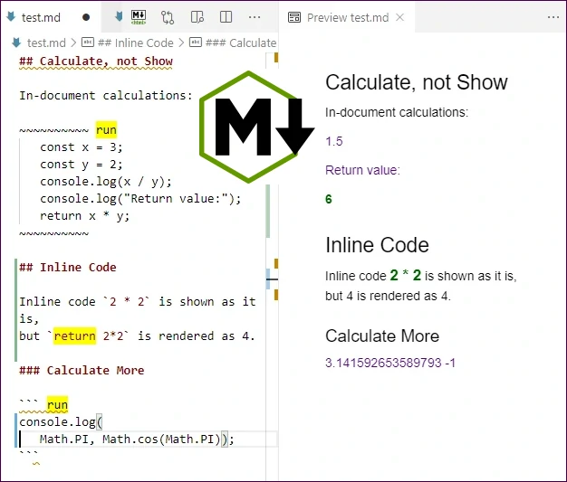

@numbering {
    enable: false
}

{title}Markdown Calculator

<!--
Original publication:
https://www.codeproject.com/Articles/5297157/Markdown-Calculator
-->

[*Sergey A Kryukov*](https://www.SAKryukov.org){.author}

This is just a funny Visual Studio Code extension, but... what can happen if somebody will try to use it seriously?

*Put the keyword (by default, "run") on the same line as the opening fence indicator.
It will force the fenced code to execute instead of rendering it. Put the keyword "return" at the beginning of the inline code sample, and the result of the calculation will be rendered as an inline element; for example, \`return 10**6` will be rendered as 1000000.*

<!-- copy to CodeProject from here ------------------------------------------->

<ul class="download"><li><a href="5291705/Working/JavaScript-Playground.zip">Download source code — 23.4 KB</a></li></ul>



<blockquote id="epigraph" class="FQ"><div class="FQA">Epigraph:</div>
<p><i>If you want to create something totally useless or ridiculous, take it very seriously.
Only then you'll have a chance to succeed.</i></p>
<dd><a href="https://www.codeproject.com/Members/SAKryukov?msg=5790846#xx5790846xx">Author</a></dd>
</blockquote>

## Content{no-toc}

@toc

## Motivation

SA???

## Usage

Let's say, on this sunny spring day, you are sending a love letter, and you want to send a million  kisses at the end of it. Of course, you need a well-formatted and maintainable document, so you use Visual Studio Code with Markdown.

Naturally, as an advanced engineer, you are not supposed to remember constants and not supposed to do anything manually. Naturally, you would prefer writing something like `10 ** 6` kisses. Or, if you are even more romantic than that, you want to send `1 << 20` kisses, that is, one *megakiss*, or, speaking more accurately, one *[mebikiss](https://en.wikipedia.org/wiki/ISO/IEC_80000#Units_of_the_ISO_and_IEC_80000_series)*.

Suppose, however, that your beloved one is not so well-versed in computer languages, and even less accustomed to binary shifts. In this case, you want to write `10 ** 6` but render it in the output document as old good 1000000 kisses.

You can do it by using the Markdown Calculator extension for VSCode and writing `return 10 ** 6` kisses instead of `10 ** 6`.

On the more mature stage of your relationship, you may need to check up your expenses and provide some proof of purchase. You can do in in VSCode using a *fenced code block* with a keyword "run" on first line:

```{lang=Javascript}
~~~ run
const tax = 0.16;
let food = 0;
const milk = 6.35; food += milk;
const meat = 35.16; food += meat;
const potato = 2 * 1.99; food += potato;
const bread = 2 * 4.25; food += bread;
const salad = 2 * 2.99; food += salad;
const taxedFood = food + food * tax;
const medicine = 434.99;
console.log(`food: ${food}`);
console.log(`medicine: ${medicine}`);
console.log(`tax: ${tax*100}%`);
console.log(`food with tax: ${taxedFood}`);
console.log(`total: ${taxedFood + medicine}`);
~~~
```

The extension will render it as a result of calculations, shown as the content of the console, created via `console.log`. However, `return` also can be used; it will be shown at the end.

You know that the lack of the `return` statement is the same as `return undefined`, and the object `undefined` is the only object rendered by this extension as an empty string, in contrast to `null`, which is rendered as "null".

In all cases, and exceptions are caught and the exception message is rendered using a special CSS style.

You can do all this using just the VSCode preview. For more serious work, you may want to convert your document into HTML; and you can do it by using the extension "[Extensible Markdown](https://github.com/SAKryukov/vscode-extensible-markdown)" described in the article *[All in One Toolchain for Article Writing with Visual Studio Code](https://www.codeproject.com/Articles/1194125/Article-Writing-Toolchain-with-VSCode)*.

## Settings

The installed extension can be turned on or off in the user or workspace settings. Also, two features, calculation performed on a fenced code block or inline code, can be turned on or off independently. Besides, the keyword "run" is configurable, as well as different CSS classes for the output of different `console` functions.

## Execution of Fenced Code Block

## Execution of Inline Code

## Mental Calculation

- Apply [some brain reading technique](https://en.wikipedia.org/wiki/Brain-reading#Human-machine_interfaces),
- Parse a mental pattern read into a command,
- Translate the command into JavaScript text,
- Pass the test to the constructor `Function`,
- Call the function,
- If case of exception, send back to the negative stimulus in the form of an electric shock.

## Conclusions
